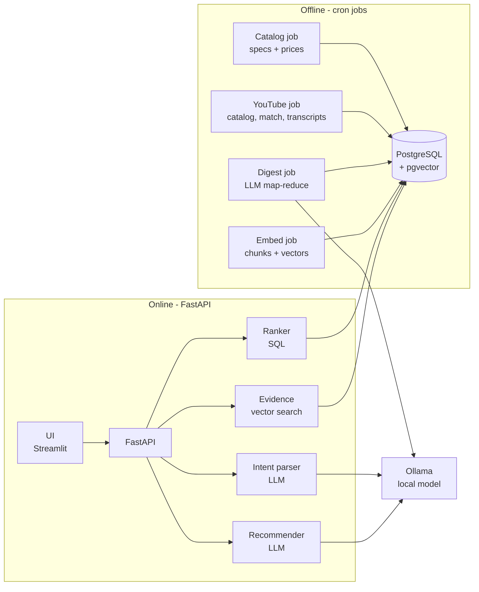
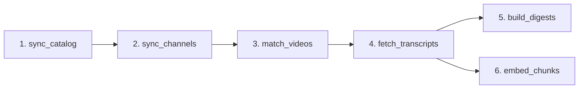
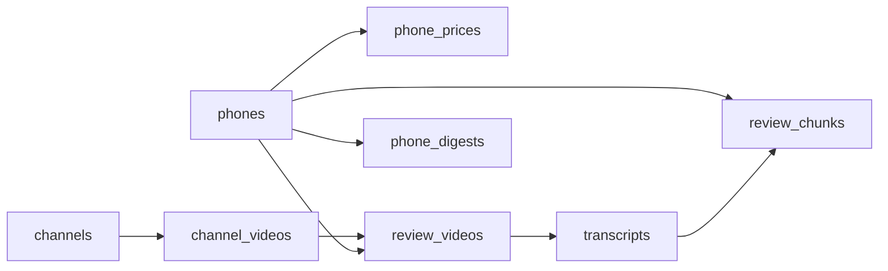
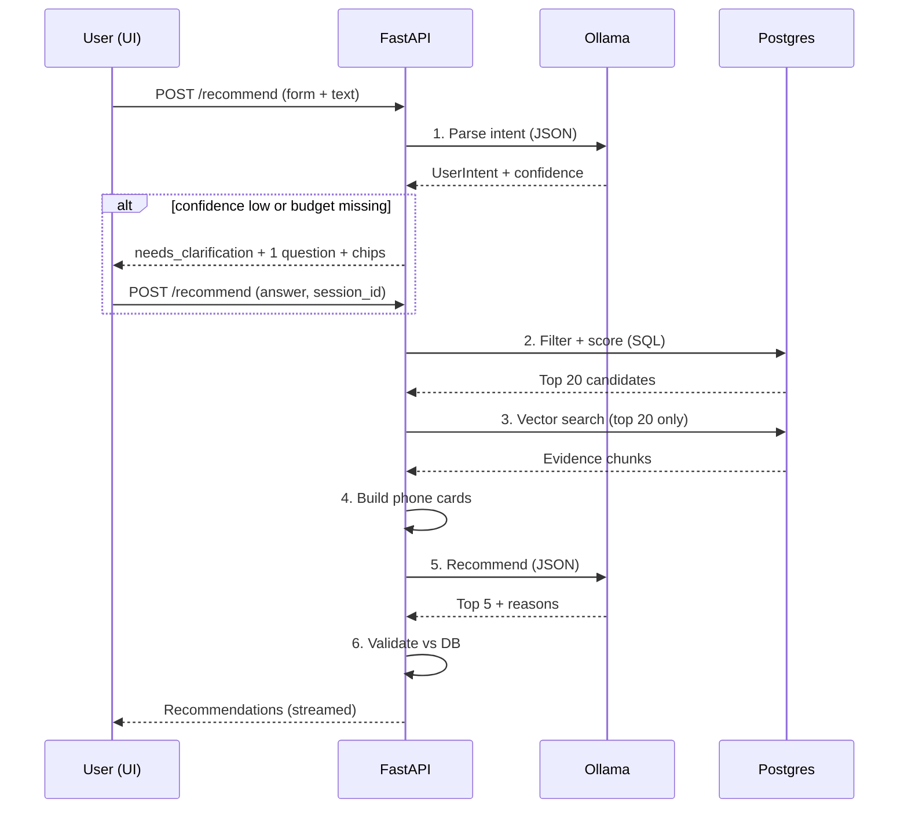

# PhoneMatch — High-Level Design

Sep 23, 2026 · Shubham Kumar Gupta

## 1. Overview

PhoneMatch recommends the 5 best phones for a user's needs and budget, with every reason grounded in real YouTube reviews. Specs and prices come from SQL; opinions come from review transcripts; a local LLM only understands the user and explains the choice.

**Goals (v1)**

- Catalog of 150–200 phones currently sold in India, refreshed by scheduled scripts.
- 3–5 review transcripts per phone from a fixed list of Indian tech reviewers.
- User answers at most 3 quick inputs; the system infers the rest.
- Top 5 recommendations with reasons, trade-offs and clickable reviewer citations (video + timestamp).
- Runs fully on a MacBook Air M4 with a local Hugging Face model — no paid API, no rate limits.

**Non-goals (v1)**

- No user accounts, payments or live price tracking.
- No scraping of Amazon/Flipkart user reviews.
- No phones older than \~24 months or not sold in India.

**Key decisions at a glance**

| Area | Decision |
| --- | --- |
| Backend | Python 3.12 + FastAPI |
| Database + RAG store | PostgreSQL 16 + pgvector (one DB) |
| LLM runtime | Ollama, local, Qwen family 7–8B instruct (4-bit) |
| Embeddings | BAAI/bge-small-en-v1.5 (384-dim), local |
| YouTube data | yt-dlp (catalog) + youtube-transcript-api (captions) |
| Jobs | Standalone Python CLI scripts, scheduled by cron |
| UI (v1) | Streamlit; React later if needed |
| Ranking | Deterministic SQL scoring; LLM picks final 5 + explains |

## 2. System architecture

The system has two halves that share one Postgres database: an **offline ingestion side** (cron scripts that build the catalog, reviews and digests) and an **online serving side** (FastAPI that answers user queries in about 30 seconds).



Offline jobs write; the online API mostly reads. The only thing both sides share is the database and the Ollama runtime.

| Component | Responsibility | Runs |
| --- | --- | --- |
| Catalog job | Pull top phones, specs, India price; upsert `phones` | Weekly cron |
| YouTube job | Refresh channel catalogs, match videos to phones, fetch transcripts | Daily cron |
| Digest job | Turn transcripts into aspect scores, pros/cons per phone (LLM) | Nightly cron, only changed phones |
| Embed job | Chunk transcripts, embed with bge-small, write vectors | Nightly, after digest |
| Intent parser | User text + form → filters, weights, use cases (LLM) | Per request |
| Ranker | Hard filters + weighted score in SQL → top 20 | Per request |
| Evidence retriever | pgvector search over the top 20's chunks | Per request |
| Recommender | Pick top 5, explain, cite (LLM) + validation | Per request |

## 3. Tech stack and reasoning

Everything is Python so the ingestion scripts, the ML code and the API share one codebase, one set of models and one language Claude can work in end to end.

| Layer | Choice | Why this, not the alternative |
| --- | --- | --- |
| Language | Python 3.12 | yt-dlp, transcript API, sentence-transformers and Ollama clients are all Python-first |
| API | FastAPI + Uvicorn | Async I/O for LLM calls, Pydantic validation of LLM JSON, auto OpenAPI docs; Django is heavier than needed for 4 endpoints |
| Validation | Pydantic v2 | Same models validate user input, LLM output and API responses |
| DB access | SQLAlchemy 2.0 (async) + Alembic | Typed queries, migrations for schema changes; raw SQL allowed for the ranking query |
| Database | PostgreSQL 16 + pgvector | Specs, digests and vectors in one DB, joined by `phone_id` (see §9) |
| LLM runtime | Ollama | One command to pull and serve HF models locally, OpenAI-compatible API, JSON-schema output |
| LLM | Qwen 3.5 9B instruct, Q4\_K\_M (\~6 GB) | Strong JSON and summarisation, handles Hinglish, fits a 16 GB Mac; fallback `qwen2.5:7b` |
| Embeddings | BAAI/bge-small-en-v1.5 via sentence-transformers (MPS) | 384-dim, fast on Apple GPU, good retrieval quality for its size |
| YouTube | yt-dlp + youtube-transcript-api | No API key, no 10k/day quota; transcripts with timestamps |
| Fuzzy match | rapidfuzz | Fast title ↔ phone-name matching |
| HTTP / scraping | httpx + selectolax | Async, fast HTML parsing for spec pages |
| Jobs | Typer CLI scripts + cron (launchd on Mac) | Each job is `python -m jobs.<name>`, runnable by hand or by cron, no extra infra |
| UI | Streamlit | A usable UI in one file; swap to React when the API is stable |
| Local infra | Docker Compose (Postgres + pgvector) | Same DB locally and on a server later |
| Quality | pytest, ruff, mypy | Tests for matching, scoring and validation logic |

All LLM calls go through one `LLMClient` class that speaks the OpenAI-compatible format. Moving to a hosted model later (Groq, Gemini, a GPU box) is a config change.

Check exact model tags in the [Ollama library](https://ollama.com/library) before pulling; open models are released often. [source](https://openclawdc.com/blog/best-local-llms-16gb-ram/)

## 4. Data sources

The phone list and India prices come from the **Flipkart Affiliate API** (official, key-based, cron-friendly); detailed specs come from **GSMArena** spec pages; a hand-curated seed file is the fallback so the pipeline never blocks on one source.

| Data | Primary source | How | Fallback |
| --- | --- | --- | --- |
| Which phones (top 100–200) | [Flipkart Affiliate API](https://affiliate.flipkart.com/api-docs/af_prod_ref.html) — Top Selling Products (up to 500 per category) for Mobiles | `Fk-Affiliate-Id` + `Fk-Affiliate-Token` headers, JSON | `data/phones_seed.yaml` (curated list) |
| Price (India) | Flipkart Affiliate API — selling price, MRP, stock | Same call; Delta Feed API for changes | Manual price in seed file |
| Specs | GSMArena device page | httpx + selectolax, 1 request / 5 s, cached HTML | Specs from Flipkart response |
| Launch date | GSMArena "Announced" field | Same page | Seed file |
| Reviews | YouTube transcripts (§5, §6) | yt-dlp + youtube-transcript-api | — |

**How the top 150–200 are selected (catalog job)**

1. Pull Flipkart top sellers for Mobiles (up to 500 listings).
2. Collapse variants (colour, RAM/storage) into one model: normalise title → `brand + model`, keep the cheapest variant price as `price_from`.
3. Drop feature phones, refurbished, and models launched more than 24 months ago.
4. Keep the top 200 by sales rank, with at least 25 models in each price band: under ₹15k, ₹15–25k, ₹25–40k, ₹40–70k, ₹70k+.
5. Resolve each model to its GSMArena page (search + rapidfuzz), scrape specs, upsert `phones`.

**Access notes**

- The Flipkart API is open to registered affiliates; register first and confirm the Mobiles category is enabled for your account. API URLs expire after 10 hours and return 500 items per page. [source](https://affiliate.flipkart.com/api-docs/af_overview.html)
- GSMArena has no public API and its terms restrict scraping. Keep it to low volume, cache every page, and do not republish their data. Fine for a portfolio project; for a commercial launch, replace it with a licensed specs source and get legal advice (not legal advice here).
- Affiliate links from the same API are the natural revenue model later.

**Open question:** if Flipkart affiliate approval is slow, start with the seed file (200 phones takes about 2 hours to list by hand) and plug the API in later — the job interface stays the same.

## 5. YouTube reviewers

We depend on 5 core Indian reviewers and 3 backups, stored in `config/channels.yaml` so the list changes without code changes. Each phone needs at least 3 videos from different channels, core first.

| Tier | Channel | Handle (verify) | Language | Why |
| --- | --- | --- | --- | --- |
| Core 1 | Geekyranjit | @Geekyranjit | English | Long, in-depth, honest reviews |
| Core 2 | C4ETech | @C4ETech | English | Detailed camera and performance testing |
| Core 3 | Beebom | @beebomco | English | Covers nearly every launch, consistent format |
| Core 4 | Gadgets 360 | @Gadgets360 | English | Structured reviews, wide coverage |
| Core 5 | Trakin Tech | @TrakinTech | Hindi | 15M+ subscribers, strong budget and mid-range coverage |
| Backup 1 | Techno Ruhez | @TechnoRuhez | Hindi | Gaming phones, budget brands (Tecno, Infinix, iQOO) |
| Backup 2 | TechBar | @TechBar | Hindi | Comparisons across price segments |
| Backup 3 | Tech Burner | @TechBurner | Hinglish | Big reach; used only when others are missing |

Subscriber counts and focus per [InditubeDB, 2026](https://www.inditubedb.com/guides/best-tech-review-youtube-channels-india-2026). Confirm each handle once by opening `youtube.com/@<handle>/videos` before the first run.

**Selection rules per phone**

1. Candidate videos = titles matching the phone (strict token match, §6 step 3) with "review" in the title.
2. Reject: "unboxing", "first look", "first impressions", "vs", "#shorts", "launch", "leaks"; duration outside 6–35 min.
3. Prefer videos published 14+ days after the phone's launch date (real-world battery and heating).
4. Take at most 1 video per channel. Fill core channels first, then backups, max 5 videos.
5. If fewer than 3 after backups → general `ytsearch` with the same filters.
6. Record `coverage` (e.g. `core:4,backup:1`). Fewer than 2 videos → `low_confidence = true`; the recommender shows a "limited reviews" badge.

## 6. Offline data pipeline

The pipeline is 6 independent CLI jobs. Each reads from the DB, does one thing, writes back, and records a row in `job_runs`. Any job can be re-run safely and resumes where it stopped.



| # | Job (`python -m jobs.<name>`) | Input → Output | Key logic | Schedule (cron) |
| --- | --- | --- | --- | --- |
| 1 | `sync_catalog` | Flipkart API + GSMArena → `phones`, `phone_prices` | Variant collapse, top-200 selection (§4), upsert by `slug` | Weekly, Sun 02:00 |
| 2 | `sync_channels` | `channels.yaml` → `channel_videos` | `yt-dlp --flat-playlist` on each channel's `/videos`; insert only new video IDs | Daily 03:00 |
| 3 | `match_videos` | `phones` × `channel_videos` → `review_videos` | Normalise + strict token match + filters (§5) | Daily 03:30 |
| 4 | `fetch_transcripts` | `review_videos` (status=pending) → raw JSON files + `transcripts` | youtube-transcript-api, prefer `en`, else `hi`; 3–5 s sleep; retry with backoff | Daily 04:00 |
| 5 | `build_digests` | `transcripts` → `phone_digests` | LLM map-reduce (§7); only phones whose transcript set changed | Nightly 01:00 |
| 6 | `embed_chunks` | `transcripts` → `review_chunks` | 75 s windows, 15 s overlap, aspect tag, bge-small vectors | Nightly, after 5 |

**Title matching (job 3) — where bugs hide**

- Normalise: lowercase, strip "5g", `+` → " plus", remove punctuation and emojis.
- Every token of the phone name must appear in the title, and the title must not contain a *variant token* the phone lacks (`pro`, `plus`, `max`, `ultra`, `lite`, `fe`, `neo`, `mini`). So "Redmi Note 14 Pro" never matches "Redmi Note 14 Pro+".
- Store `match_score`; anything below 90 goes to a `needs_review` status and a short CSV report for manual check.
- Keep a pytest file with 30+ tricky name pairs as the regression suite.

**Reliability rules (all jobs)**

- **Idempotent:** upsert by natural keys (`slug`, `video_id`); a re-run never duplicates.
- **Resumable:** per-row state, so a crash at phone 180 restarts at 180: `review_videos.status` (`pending → fetched`, or `needs_review` / `rejected` / `failed` with `error`); `transcripts.map_json` + `map_prompt_version` (NULL or old prompt → re-map); `phone_digests.source_hash` (changed → rebuild); `transcripts.embedded_at` (NULL → embed).
- **Raw layer kept:** every transcript saved to `data/raw/transcripts/<video_id>.json`; digests and chunks can be rebuilt without refetching.
- **Rate limits:** sleep between YouTube calls, max 300 transcript fetches per run; on HTTP 429 stop the run and let the next cron continue.
- **Content hash:** digests rebuild only when a phone's set of `video_id`s changes.
- **Run log:** `job_runs(job, started_at, finished_at, processed, failed, status)` for simple monitoring.

**Scheduling on the MacBook:** cron (or launchd) runs `scripts/run_nightly.sh`, which calls jobs 2–6 in order. The Mac must be awake and plugged in; the fanless Air slows down on long LLM runs, so digests run overnight. Moving to a server later needs no code change, only a new crontab.

**First full run (200 phones):** about 600–900 videos, \~30–45 min to fetch transcripts, \~6–10 h for digests on a local 9B model, a few minutes for embeddings. Later nightly runs only touch new launches and new videos.

## 7. LLM usage per phase

The LLM is used in exactly 4 places: two offline (summarising reviews) and two online (understanding the user, explaining the picks). It never ranks phones by itself and never supplies prices or specs.

| Phase | Where | Model (Ollama, local) | Input | Output (JSON schema) | Temp |
| --- | --- | --- | --- | --- | --- |
| A. Transcript map | Job 5 | Qwen 3.5 9B Q4 | 1 transcript (\~3–5k tokens) + phone name | `{camera, battery, performance, display, thermals, software, build: {score 0–10, notes}, pros[], cons[], gaming_notes, verdict}` | 0 |
| B. Digest reduce | Job 5 | Qwen 3.5 9B Q4 | 3–5 phase-A JSONs | Final `phone_digests` row + `disagreements[]` | 0 |
| C. Intent parsing | Online, step 1 | Small model (Qwen 3–4B class) or same 9B | Form fields + free text | `UserIntent` (§11) + `confidence` + `missing[]` | 0 |
| D. Recommendation | Online, step 5 | Qwen 3.5 9B Q4 | Intent + 20 phone cards + evidence | `{recommendations: [{phone_id, rank, why, tradeoff, evidence_ids[]}], summary}` | 0.2 |

**Not LLM (on purpose)**

- Aspect tagging of chunks: keyword rules first (camera, battery, charging, heat, BGMI, display, update); cheap and good enough.
- Embeddings: bge-small (not an LLM).
- Ranking and filtering: SQL.
- Title matching: rapidfuzz + rules.

**Rules for every LLM call**

- Always pass a JSON schema through Ollama's `format`, then validate with the matching Pydantic model. On failure: 1 retry with the validation error appended, then fall back (phase A/B: mark `failed`; phase C: form-only intent; phase D: SQL top 5 with template reasons).
- Set `num_ctx` explicitly (8192 for A and D, 4096 for C). Ollama's default window is small and silently truncates input.
- Prompts live in `app/prompts/*.md`, versioned; `phone_digests.prompt_version` records which prompt built each row so digests can be rebuilt when prompts change.
- Hindi and Hinglish transcripts go straight to the model with the instruction "answer in English"; no separate translation step.
- Scores are relative within our catalog. Phase B is told to anchor on reviewer statements, not spec sheets, and to output `null` for aspects no reviewer discussed.

**Expected latency on MacBook Air M4 (16 GB)**

| Call | Rough time |
| --- | --- |
| C. Intent parsing | 2–5 s |
| D. Recommendation (\~5k tokens in, \~500 out) | 20–35 s |
| A + B per phone (offline) | 2–4 min |

## 8. Database design

One PostgreSQL database, 10 tables. `phones` is the master; every review, digest and chunk carries `phone_id` as a foreign key.



`job_runs` and `query_logs` stand alone.

```sql
CREATE EXTENSION IF NOT EXISTS vector;

CREATE TABLE phones (
  id             SERIAL PRIMARY KEY,
  slug           TEXT NOT NULL UNIQUE,                 -- 'redmi-note-14-pro'
  brand          TEXT NOT NULL,
  model          TEXT NOT NULL,
  launch_date    DATE,
  price_from     INT  CHECK (price_from > 0),          -- INR, cheapest variant
  price_band     TEXT CHECK (price_band IN ('u15k','15-25k','25-40k','40-70k','70k+')),
  sales_rank     INT,
  os             TEXT CHECK (os IN ('android','ios')),
  chipset        TEXT,
  antutu         INT,
  ram_gb_max     INT,
  storage_gb_max INT,
  display_in     REAL,
  display_type   TEXT,                                 -- AMOLED / LCD
  refresh_hz     INT,
  battery_mah    INT,
  charging_w     INT,
  main_cam_mp    INT,
  has_ois        BOOLEAN,
  is_5g          BOOLEAN,
  weight_g       INT,
  ip_rating      TEXT,
  update_years   INT,
  flipkart_url   TEXT,
  gsmarena_url   TEXT,
  is_active      BOOLEAN     NOT NULL DEFAULT true,
  created_at     TIMESTAMPTZ NOT NULL DEFAULT now(),
  updated_at     TIMESTAMPTZ NOT NULL DEFAULT now()
);
CREATE INDEX ix_phones_is_active_price_from ON phones (is_active, price_from);

CREATE TABLE phone_prices (                            -- price history
  phone_id    INT  NOT NULL REFERENCES phones(id) ON DELETE CASCADE,
  variant     TEXT NOT NULL,                           -- '8/256'
  price       INT  NOT NULL CHECK (price > 0),
  mrp         INT  CHECK (mrp > 0),
  in_stock    BOOLEAN,
  captured_at TIMESTAMPTZ NOT NULL DEFAULT now(),
  PRIMARY KEY (phone_id, variant, captured_at)
);

CREATE TABLE channels (
  id             SERIAL PRIMARY KEY,
  handle         TEXT NOT NULL UNIQUE,
  name           TEXT NOT NULL,
  tier           TEXT NOT NULL CHECK (tier IN ('core','backup')),
  language       TEXT,
  is_active      BOOLEAN NOT NULL DEFAULT true,
  last_synced_at TIMESTAMPTZ
);

CREATE TABLE channel_videos (                          -- full catalog per channel
  video_id      TEXT PRIMARY KEY,
  channel_id    INT  NOT NULL REFERENCES channels(id),
  title         TEXT NOT NULL,
  duration_s    INT,
  published_at  DATE,
  first_seen_at TIMESTAMPTZ NOT NULL DEFAULT now()
);
CREATE INDEX ix_channel_videos_channel_id ON channel_videos (channel_id);
CREATE INDEX ix_channel_videos_title_tsv  ON channel_videos USING gin (to_tsvector('simple', title));

CREATE TABLE review_videos (                           -- video matched to a phone
  id          SERIAL PRIMARY KEY,
  phone_id    INT  NOT NULL REFERENCES phones(id) ON DELETE CASCADE,
  video_id    TEXT NOT NULL REFERENCES channel_videos(video_id),
  match_score REAL CHECK (match_score BETWEEN 0 AND 100),
  status      TEXT NOT NULL DEFAULT 'pending'
              CHECK (status IN ('pending','needs_review','fetched','failed','rejected')),
  error       TEXT,
  created_at  TIMESTAMPTZ NOT NULL DEFAULT now(),
  updated_at  TIMESTAMPTZ NOT NULL DEFAULT now(),
  UNIQUE (phone_id, video_id)
);
CREATE INDEX ix_review_videos_status   ON review_videos (status);
CREATE INDEX ix_review_videos_video_id ON review_videos (video_id);

CREATE TABLE transcripts (
  video_id           TEXT PRIMARY KEY REFERENCES channel_videos(video_id),
  language           TEXT    NOT NULL,
  is_auto            BOOLEAN NOT NULL,
  raw_path           TEXT    NOT NULL,                 -- data/raw/transcripts/<id>.json
  word_count         INT,
  map_json           JSONB,                            -- phase A output (NULL = not mapped yet)
  map_prompt_version TEXT,                             -- prompt that produced map_json
  embedded_at        TIMESTAMPTZ,                      -- NULL = not embedded yet (job 6)
  fetched_at         TIMESTAMPTZ NOT NULL DEFAULT now()
);

CREATE TABLE phone_digests (
  phone_id       INT PRIMARY KEY REFERENCES phones(id) ON DELETE CASCADE,
  camera REAL, battery REAL, performance REAL, display REAL,
  thermals REAL, software REAL, build REAL,            -- 0-10, NULL = not discussed; each CHECK 0..10
  pros           TEXT[]  NOT NULL DEFAULT '{}',
  cons           TEXT[]  NOT NULL DEFAULT '{}',
  gaming_notes   TEXT,
  summary        TEXT,
  disagreements  JSONB,
  source_videos  TEXT[]  NOT NULL DEFAULT '{}',
  coverage       TEXT,                                 -- 'core:4,backup:1'
  low_confidence BOOLEAN NOT NULL DEFAULT false,
  source_hash    TEXT    NOT NULL,                     -- hash of video_ids used
  prompt_version TEXT    NOT NULL,
  model          TEXT    NOT NULL,
  built_at       TIMESTAMPTZ NOT NULL DEFAULT now()
);

CREATE TABLE review_chunks (
  id        BIGSERIAL PRIMARY KEY,
  phone_id  INT  NOT NULL REFERENCES phones(id) ON DELETE CASCADE,
  video_id  TEXT NOT NULL REFERENCES transcripts(video_id) ON DELETE CASCADE,
  start_sec INT  NOT NULL CHECK (start_sec >= 0),
  aspect    TEXT,
  text      TEXT NOT NULL,
  embedding VECTOR(384) NOT NULL,
  UNIQUE (phone_id, video_id, start_sec)               -- natural key; also serves phone_id lookups
);
CREATE INDEX ix_review_chunks_embedding ON review_chunks USING hnsw (embedding vector_cosine_ops);

CREATE TABLE job_runs (
  id          SERIAL PRIMARY KEY,
  job         TEXT NOT NULL,
  started_at  TIMESTAMPTZ NOT NULL DEFAULT now(),
  finished_at TIMESTAMPTZ,
  processed   INT  NOT NULL DEFAULT 0,
  failed      INT  NOT NULL DEFAULT 0,
  status      TEXT NOT NULL DEFAULT 'running'
              CHECK (status IN ('running','success','partial','failed')),
  notes       TEXT
);
CREATE INDEX ix_job_runs_job_started_at ON job_runs (job, started_at DESC);

CREATE TABLE query_logs (
  id            BIGSERIAL PRIMARY KEY,
  created_at    TIMESTAMPTZ NOT NULL DEFAULT now(),
  session_id    TEXT,
  raw_input     JSONB NOT NULL,
  intent        JSONB,
  candidate_ids INT[],
  result        JSONB,
  latency_ms    INT,
  fallback_used BOOLEAN NOT NULL DEFAULT false,
  feedback      SMALLINT CHECK (feedback IN (-1, 1))   -- +1 / -1, NULL = none
);
CREATE INDEX ix_query_logs_session_id ON query_logs (session_id);
```

**Design notes**

- The authoritative schema is the Alembic migration history (`app/db/alembic/versions/`); this block mirrors it.
- Closed sets (`price_band`, `os`, `tier`, statuses, 0–10 scores, `feedback`) use `CHECK` constraints, not Postgres ENUMs, so adding a value is a one-line migration.
- `ON DELETE CASCADE` only on data derived from a phone or transcript (prices, matches, digests, chunks). Phones are normally deactivated (`is_active = false`), not deleted.
- `review_chunks (phone_id, video_id, start_sec)` is the natural key `embed_chunks` upserts on; it also serves `phone_id` lookups.
- All constraints and indexes have explicit names (SQLAlchemy naming convention) so migrations can drop them reliably.

- `channel_videos` holds every video of every channel; `review_videos` is only the matches. A wrong match is fixed by setting `status = 'rejected'` and re-running jobs 5–6 for that phone.
- `phone_prices` keeps history so a "price dropped" feature is possible later; `phones.price_from` is the current value used for filtering.
- `query_logs` is the evaluation dataset: real queries, what was shown, and thumbs up/down.
- At \~200 phones and \~25k chunks the HNSW index is optional; it is included so nothing changes at 2,000 phones.

## 9. RAG store: pgvector

We use **pgvector inside the same PostgreSQL database**. Every vector search here is filtered by `phone_id IN (top 20 from SQL)`, so keeping vectors next to the relational data turns retrieval into one SQL query instead of a cross-system join.

| Option | Fit for this project | Verdict |
| --- | --- | --- |
| **pgvector (Postgres)** | Filter + join + vector search in one query; one DB to back up, migrate and run; ACID with the rest of the data; HNSW handles millions of rows | **Chosen** |
| Chroma | Easy locally, but a second store; metadata filters are weaker; must keep `phone_id` in sync by hand | Good for a notebook prototype only |
| Qdrant | Excellent filtering and speed, but a separate service with its own ops; scale we won't reach (\~25k chunks) | Consider past \~10M vectors |
| Pinecone / Weaviate Cloud | Managed, paid, network hop, data leaves the machine | Overkill; breaks the fully-local goal |
| FAISS | Fast library, but no persistence, filtering or joins without extra code | Too low-level |

**The retrieval query**

```sql
SELECT c.id, c.phone_id, c.text, c.start_sec, c.video_id, ch.name AS channel,
       1 - (c.embedding <=> :q) AS similarity
FROM review_chunks c
JOIN channel_videos v ON v.video_id = c.video_id
JOIN channels ch      ON ch.id = v.channel_id
WHERE c.phone_id = ANY(:candidate_ids)
  AND (:aspects IS NULL OR c.aspect = ANY(:aspects))
ORDER BY c.embedding <=> :q
LIMIT 60;
```

Then keep the best 2 chunks per phone in Python. With pgvector 0.8+, set `hnsw.iterative_scan = relaxed_order` so filtered HNSW queries still return enough rows; at our size an exact scan is also fast enough.

**Query text for the embedding:** built from the intent's use cases, e.g. `"BGMI gaming performance heating frame drops"` or `"low light night photos camera"`, one embedding per use case (max 3).

## 10. Online request flow

A request runs 6 steps; only steps 1 and 5 touch the LLM, and every step has a fallback so the user always gets an answer.



| Step | What happens | Fallback |
| --- | --- | --- |
| 1. Parse intent | Form fields are taken as-is; free text → weights, use cases, must-haves (§11) | LLM fails → form values + default weights |
| 2. Filter + score | Hard filters (budget +5%, 5G, brand exclusions, OS, size), then weighted score → top 20 | < 5 results → relax in order: budget +10%, drop soft must-haves, tell the user what was relaxed |
| 3. Evidence | pgvector search per use case over the 20 candidates; 2 chunks per phone | No chunks → cards use digest only |
| 4. Phone cards | \~200 tokens each: price, key specs, aspect scores, pros/cons, evidence with `[E12]` ids | — |
| 5. Recommend | LLM picks 5, orders them, writes why + trade-off, cites evidence ids | Invalid twice → SQL top 5 + template reasons |
| 6. Validate | `phone_id` must be in candidates; evidence ids must exist; price/specs pulled from DB, not from LLM text; drop duplicates | Invalid items dropped and refilled from SQL order |

**Scoring formula (step 2)**

```latex
\text{score} = 0.8 \sum_{a} w_a \cdot \text{digest}_a + 0.2 \cdot \text{value}, \quad \text{value} = 10 \cdot \left(1 - \frac{\text{price}}{\text{budget}_{max}}\right)
```

Weights `w` come from the intent and sum to 1 over camera, battery, performance, display, thermals, software, build. A missing digest aspect uses the catalog median, with a 10% penalty if `low_confidence`. The value term gives a small edge to phones that meet the needs for less money.

**Step 5 prompt contract (summary)**

- System: "You recommend phones only from the provided list. Use only facts in the cards. Cite evidence ids. Prefer phones whose cons don't hit the user's top priority."
- User: intent JSON + 20 cards.
- Output: exactly 5 items, each `why` ≤ 40 words, one `tradeoff`, 1–3 `evidence_ids`.

**Response to UI:** each card shows name, price (from DB), 2–3 reasons, a trade-off, reviewer citations linking to `youtube.com/watch?v=<id>&t=<start_sec>s`, a Flipkart link, and a "limited reviews" badge when `low_confidence`. Results are cached for 24 h by a hash of the normalised intent.

## 11. User input design

The user gives at most **1 required field and 2 optional taps**; the system infers everything else and asks at most **one** follow-up question, only when the answer would change the top 5.

**The input screen**

| # | Input | Type | Required |
| --- | --- | --- | --- |
| 1 | Budget | Slider ₹8k–₹1.5L, or chips: under 15k / 15–25k / 25–40k / 40–70k / 70k+ | Yes |
| 2 | What matters most | Pick up to 2 chips: Camera, Battery, Gaming, Display, Clean software, Compact, Long updates | No |
| 3 | Anything else? | One free-text line, placeholder: "e.g. I play BGMI daily, no Chinese brands" | No |

No spec jargon (AMOLED, mAh, Snapdragon) anywhere on the form. Chips map to weights in code, not in the LLM.

**The intent object**

```python
class UserIntent(BaseModel):
    budget_min: int | None
    budget_max: int
    weights: dict[Aspect, float]  # sums to 1
    use_cases: list[str] = []  # 'gaming:BGMI', 'photography:kids'
    must_have: list[str] = []  # '5g', 'ois', 'ip68', 'compact'
    exclude_brands: list[str] = []
    os: Literal["android", "ios", "any"] = "any"
    confidence: float  # 0-1, from parser
    missing: list[str] = []  # what we would like to know
```

**How weights are filled**

1. Start from a **default profile** per budget band (e.g. under 15k: battery 0.3, performance 0.25, camera 0.2, display 0.15, software 0.1).
2. Each chosen chip adds weight to its aspect (first chip +0.25, second +0.15), then re-normalise.
3. Free text adjusts further via the LLM ("play BGMI daily" → performance and thermals up), capped so text can't override chips.

**When we are not sure what the user wants**

| Situation | Behaviour |
| --- | --- |
| Only budget given | Don't ask. Use the band's default profile and label results "Best all-rounders under ₹X". Show chips above the results to refine in one tap. |
| Budget missing but text given ("good camera phone") | Ask one question: "What's your budget?" with the 5 budget chips. Budget is the only hard blocker. |
| Text is vague ("a good phone for my dad") | Parser returns `confidence < 0.6` and a `missing` list. Ask one multiple-choice question from a fixed bank, e.g. "What will he use it for most?" → Calls & WhatsApp / Photos / YouTube / Banking apps. |
| Conflicting needs ("flagship camera under 12k") | Don't refuse. Return the best-in-budget, and show one line: "Camera-focused phones start around ₹18k — see 2 options slightly above budget." |
| Needs fit nothing after relaxing | Show the closest 3 and say which requirement was dropped. |
| Irrelevant or unsafe text | Ignore the text, use form values. |

**Clarification rules**

- Maximum 1 follow-up per session; after that, always recommend.
- Questions are **multiple choice from a fixed bank** (not LLM-written), so the UI stays consistent. The LLM only chooses *which* question via `missing`.
- Every answer is also a chip, so a user who skips the question still gets results.
- After results, show a "Refine" row ("More battery", "Cheaper", "Smaller phone") that re-runs from step 2 with adjusted weights — no LLM call needed, so it responds in under a second.

## 12. API design

Five endpoints, all JSON, versioned under `/api/v1`. `/recommend` is the only one that calls the LLM.

| Method | Path | Purpose |
| --- | --- | --- |
| POST | `/api/v1/recommend` | Main flow; returns results or a clarification question |
| POST | `/api/v1/recommend/refine` | Re-rank with adjusted weights, no LLM (≤1 s) |
| GET | `/api/v1/phones/{id}` | Phone detail: specs, digest, sources |
| POST | `/api/v1/feedback` | Thumbs up/down on a result set |
| GET | `/api/v1/health` | DB, Ollama and last job-run status |

**POST /recommend — request**

```json
{
  "session_id": null,
  "budget": {"min": null, "max": 30000},
  "priorities": ["camera", "battery"],
  "text": "I play BGMI sometimes, no Chinese brands",
  "clarification_answer": null
}
```

**Response A — needs clarification**

```json
{
  "status": "needs_clarification",
  "session_id": "b1f2...",
  "question": {"id": "primary_use", "text": "What will you use it for most?",
               "options": ["Calls & WhatsApp", "Photos", "Gaming", "Videos"]}
}
```

**Response B — results**

```json
{
  "status": "ok",
  "session_id": "b1f2...",
  "intent": {"budget_max": 30000, "weights": {"camera": 0.35, "battery": 0.3, "performance": 0.2, "display": 0.1, "software": 0.05}},
  "relaxed": [],
  "recommendations": [
    {
      "rank": 1,
      "phone": {"id": 17, "name": "Phone X", "price_from": 28999, "flipkart_url": "..."},
      "why": "Best camera in your budget and lasts a full day with heavy use.",
      "tradeoff": "Warms up after 20 min of BGMI.",
      "evidence": [{"channel": "Geekyranjit", "quote": "...", "url": "https://youtube.com/watch?v=abc123&t=312s"}],
      "low_confidence": false
    }
  ],
  "fallback_used": false,
  "latency_ms": 27400
}
```

**Implementation notes**

- Streaming: `/recommend?stream=true` returns Server-Sent Events — first the intent and candidate list (fast), then each recommendation as the LLM finishes it.
- Sessions: an in-memory dict (or Redis later) keyed by `session_id`, holding intent and candidates for 30 min, so clarification and refine don't redo work.
- Errors: 422 for bad input (Pydantic), 503 if Ollama is down (the UI shows the SQL-only results instead).

## 13. Project structure and build plan

Build in 8 milestones, each small enough for one Claude session, each ending with something runnable and tested. Put this HLD in the repo as `docs/HLD.md` and a short `CLAUDE.md` so every session starts with the same context.

```text
phonematch/
├─ CLAUDE.md                 # rules: stack, conventions, how to run tests
├─ docs/HLD.md               # this document
├─ docker-compose.yml        # infra only: postgres:16 + pgvector (API/jobs/Ollama run natively)
├─ docker/postgres/init/     # first-start SQL (creates phonematch_test)
├─ alembic.ini               # script_location = app/db/alembic
├─ pyproject.toml            # uv, ruff, mypy, pytest
├─ config/
│  ├─ settings.py            # pydantic-settings, reads .env
│  ├─ channels.yaml          # §5 reviewers
│  └─ profiles.yaml          # default weights per budget band
├─ data/
│  ├─ phones_seed.yaml       # fallback catalog
│  └─ raw/transcripts/       # <video_id>.json (git-ignored)
├─ app/
│  ├─ main.py                # FastAPI app
│  ├─ api/v1/                # routers: recommend, phones, feedback, health
│  ├─ schemas/               # Pydantic: UserIntent, PhoneCard, Recommendation
│  ├─ db/                    # SQLAlchemy models, session, alembic/
│  ├─ services/
│  │  ├─ intent.py           # step 1
│  │  ├─ ranker.py           # step 2
│  │  ├─ evidence.py         # step 3
│  │  ├─ cards.py            # step 4
│  │  ├─ recommender.py      # step 5 + 6
│  │  └─ clarify.py          # question bank + rules
│  ├─ llm/client.py          # LLMClient (OpenAI-compatible, Ollama)
│  ├─ embeddings.py          # bge-small loader
│  └─ prompts/               # intent.md, map.md, reduce.md, recommend.md
├─ jobs/                     # each: python -m jobs.<name>
│  ├─ sync_catalog.py
│  ├─ sync_channels.py
│  ├─ match_videos.py
│  ├─ fetch_transcripts.py
│  ├─ build_digests.py
│  └─ embed_chunks.py
├─ scripts/run_nightly.sh    # cron entrypoint
├─ ui/streamlit_app.py
└─ tests/                    # matcher, ranker, validator, api
```

| # | Milestone | Done when | Est. |
| --- | --- | --- | --- |
| M0 | Repo skeleton, Docker Postgres, Alembic migration for §8, settings, health endpoint | `docker compose up` + `/health` green | 0.5 day |
| M1 | `sync_catalog` from seed YAML (Flipkart API behind the same interface) | 50 phones in `phones` | 1 day |
| M2 | `sync_channels` + `match_videos` + matcher tests | ≥3 matched videos for 40 of 50 phones; 30 tricky-name tests pass | 1.5 days |
| M3 | `fetch_transcripts` with resume + raw files | Transcripts for all matched videos; re-run fetches nothing | 1 day |
| M4 | `LLMClient` + `build_digests` (map-reduce) | 50 digests, valid JSON, spot-check 5 by hand | 1.5 days |
| M5 | `embed_chunks` + evidence query | Vector search returns sensible chunks for 5 test queries | 0.5 day |
| M6 | `/recommend` steps 1–6 + clarification + fallback | 10 test personas return 5 valid phones each | 2 days |
| M7 | Streamlit UI + refine + feedback + streaming | End-to-end demo on laptop | 1 day |
| M8 | Scale to 200 phones, cron, Flipkart API, eval report | Nightly run succeeds 3 days in a row | 1–2 days |

**How to work with Claude on this**

- One milestone per session. Start with: "Read `CLAUDE.md` and `docs/HLD.md` §X, implement milestone MX, write tests first."
- Keep `CLAUDE.md` short: stack, folder rules, "all LLM calls through `LLMClient`", "prices and specs only from DB", commands (`make test`, `make migrate`, `make nightly`).
- Every milestone goes spec → plan → code. First `.claude/specs/<Mx-name>.md` (what/why, Pydantic schemas, SQL, signatures) is reviewed and approved. Then `.claude/plans/<Mx-name>.md` (files, ordered steps, tests, verification) is approved. Only then is code written. Both folders have a `_TEMPLATE.md`.
- Commit after each milestone so a bad session is easy to roll back.

## 14. Risks, evaluation, observability

The biggest risks are data access (Flipkart approval, YouTube blocking) and wrong video matches; both have fallbacks, and matching has a test suite.

| Risk | Impact | Mitigation |
| --- | --- | --- |
| Flipkart affiliate access delayed or Mobiles not enabled | No auto catalog | Seed YAML; same job interface |
| youtube-transcript-api blocked (429 / IP block) | No new transcripts | Sleep 3–5 s, cap per run, resume next night; raw files mean nothing is lost |
| Wrong video matched to a phone | Wrong reviews in digest | Strict variant-token rule, `match_score` review queue, tests |
| Transcripts disabled / only Hindi auto-captions | Thin coverage | Backups + general search; `low_confidence` badge |
| LLM invents facts or phones | Loss of trust | Cards-only context, JSON schema, step 6 validation, prices from DB |
| Launch-day sponsored reviews too positive | Biased scores | Prefer videos 14+ days after launch; multiple channels; `disagreements` field |
| Specs scraping ToS | Legal risk if commercial | Low volume, cache, no republishing; licensed source before any launch |
| Mac asleep during cron | Missed runs | launchd with wake, or move jobs to a small VM later |
| Slow local LLM (20–35 s) | Poor UX | Streaming, cache by intent hash, refine without LLM |

**Evaluation**

- **Test personas:** 30 written personas ("student, 15k, gaming", "dad, 20k, calls + camera", "iPhone only, 70k") with an acceptable set of phones each. Metric: share of top 5 inside the acceptable set; target ≥ 70%.
- **Grounding check:** every `evidence_id` exists and its chunk belongs to that phone; target 100%.
- **Digest spot-check:** hand-review 10 random digests after each prompt change.
- **Online:** thumbs up/down in `query_logs`; review the thumbs-down weekly.

**Observability (kept simple)**

- Structured JSON logs with `request_id`, per-step latency, `fallback_used`.
- `job_runs` table + `/health` showing last successful run per job.
- A weekly `make report` printing: phones without digest, `low_confidence` count, match queue size, eval score.

**Sources**

- [Flipkart Affiliate API — Product APIs reference](https://affiliate.flipkart.com/api-docs/af_prod_ref.html)
- [Flipkart Affiliate API — Overview](https://affiliate.flipkart.com/api-docs/af_overview.html)
- [Best Tech Review YouTube Channels in India (2026) — InditubeDB](https://www.inditubedb.com/guides/best-tech-review-youtube-channels-india-2026)
- [Best Local LLMs for 16GB RAM — OpenClaw](https://openclawdc.com/blog/best-local-llms-16gb-ram/)
- [Ollama model library](https://ollama.com/library)
